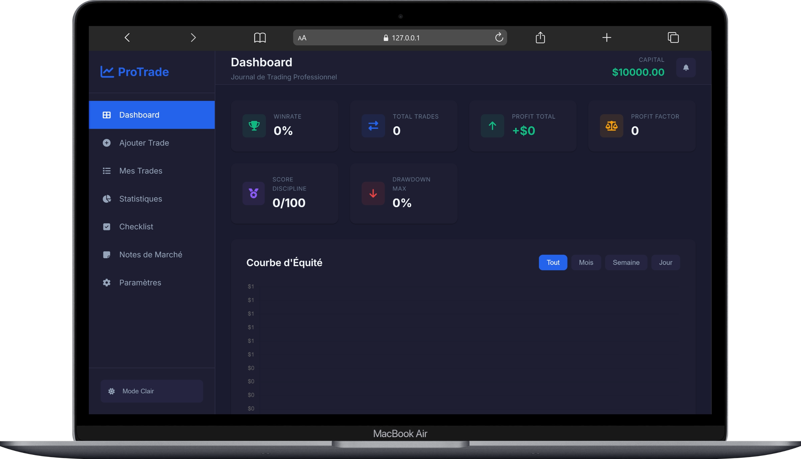

# ProTrade Journal

<p align="center">
  
  
  
</p>

Professional trading journal for Forex and Crypto. Track, analyze, and improve your trading performance with advanced tools and a modern interface.



## Features

### 📊 Dashboard
- Complete overview of your performance
- Winrate, total profit, profit factor
- Discipline score and maximum drawdown
- Interactive equity curve with Chart.js
- Recent trades and performance by pair

### ➕ Add Trade
- Complete record: pair, type (Buy/Sell), trading style
- Lot size, stop loss and take profit management
- Automatic Risk/Reward Ratio calculation
- Analytical tags: BOS, FVG, Liquidity Grab, Trendline, Fibo, etc.
- Screenshot and comment support

### 📋 Trades List
- Complete table with all details
- Advanced filters (pair, type, result, date, tag)
- CSV and PDF export
- Screenshot visualization

### 📈 Detailed Statistics
- Winrate with visual chart
- Profit Factor
- Average wins and losses
- Consecutive wins/losses
- Statistics by pair, type and RR
- Time filters (day, week, month, all)

### ✅ Pre-Trade Checklist
- Market analysis (trend, levels, patterns)
- Risk management (RR ≥ 1:3, risk ≤ 2%)
- Timing and mental state
- Save system

### 📝 Market Notes
- Custom notes
- Observations and analysis
- Simple and fast management

### ⚙️ Settings
- Configurable initial capital
- Export/import all data
- Dark/light mode
- Complete reset

## Technologies

- **HTML5** - Modern and accessible structure
- **CSS3** - Responsive design with CSS Variables
- **JavaScript (Vanilla)** - Business logic without framework
- **Chart.js** - Interactive charts
- **jsPDF** - PDF export
- **LocalStorage** - Local data persistence

## Installation

1. Clone the project:
```bash
git clone https://github.com/your-username/protrade-journal.git
```

2. Open `index.html` in your browser

No dependencies required!

## Deployment

The project is configured for Vercel deployment. Simply connect your repository.

## Project Structure

```
protrade-journal/
├── index.html          # Main structure
├── styles.css         # CSS styles
├── app.js            # Main JavaScript logic
├── create_app.js     # Creation utilities
├── vercel.json       # Vercel configuration
└── README.md         # Documentation
```

## Key Metrics

| Metric | Description |
|--------|-------------|
| Winrate | Percentage of winning trades |
| Profit Factor | Gross profit / gross loss ratio |
| Max Drawdown | Largest capital decline |
| Discipline Score | Rule adherence evaluation |

## Screenshots

### Dashboard


### Add Trade
.png)

### Trades List
.png)

### Statistics
.png)

### Checklist & Notes
.png)

## License

MIT License - Free to use and modify.


---

Built with ❤️ for ambitious traders

